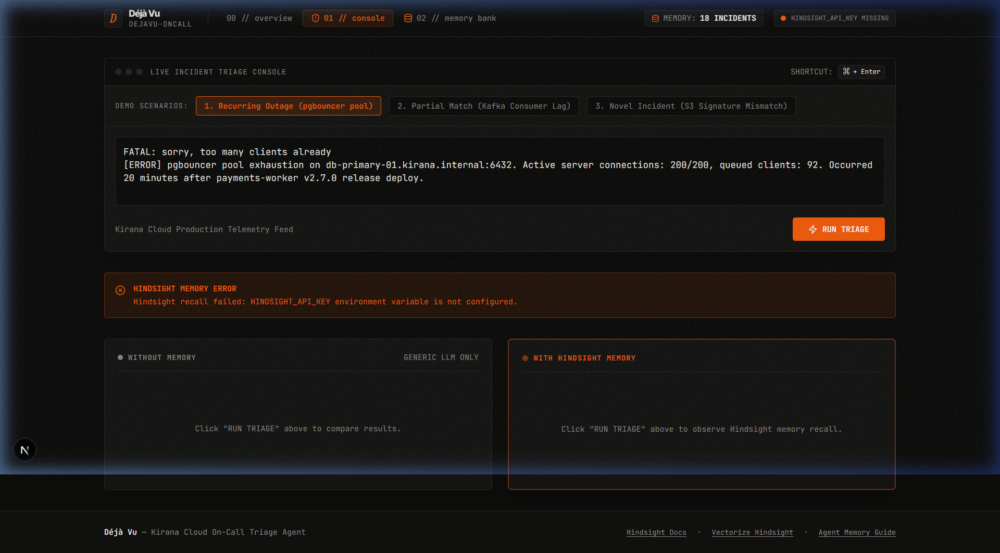
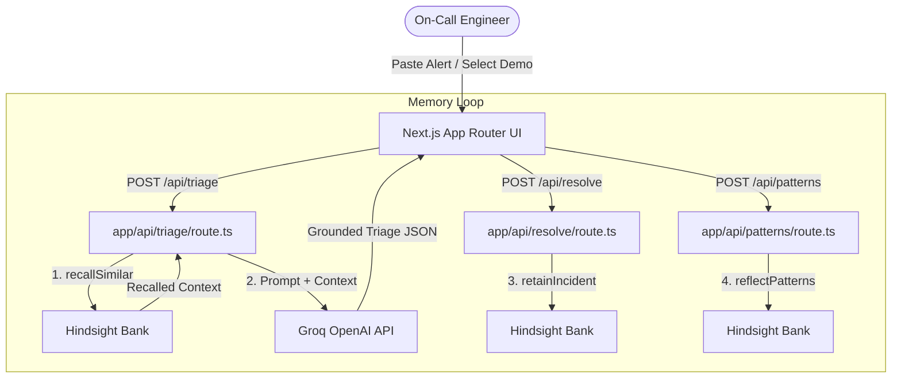

# Déjà Vu (dejavu-oncall)

> **"The on-call agent that has seen this outage before."**



## The Problem
When production breaks at 2 AM, the on-call engineer starts from zero. The fix for this exact failure usually exists in a Slack thread or postmortem from weeks ago that nobody remembers. Generic LLMs give generic advice ("check your logs, restart the service"), missing critical operational parameters and historical failure patterns.

## The Solution
**Déjà Vu** is an incident-response agent powered by [Hindsight](https://github.com/vectorize-io/hindsight) (Vectorize's agent memory engine). It retains every resolved production incident—including symptoms, root cause, exact resolution steps, what didn't work, and who resolved it—alongside team operational rules. When a new alert fires, Déjà Vu recalls past incidents, grounds its triage in recalled memory, and uses reflection to identify systemic failure loops across the incident ledger.

---

## How Hindsight Memory is Used

Déjà Vu leverages Hindsight via `@vectorize-io/hindsight-client` across three primary workflows:



### 1. Retain (`lib/hindsight.ts` & `app/api/seed/route.ts`)
Each resolved incident is stored as a rich natural-language memory document with ISO timestamps and tags:
```typescript
// Retain single incident document into Hindsight bank
await client.retain(bankId, formatIncidentDocument(incident), {
  timestamp: new Date(incident.started_at),
  context: "resolved production incident",
  documentId: incident.id,
  tags: [incident.service, incident.severity, "incident"],
  metadata: { incident_id: incident.id, service: incident.service }
});
```

### 2. Recall (`lib/hindsight.ts` & `app/api/triage/route.ts`)
When a raw alert fires, Hindsight recalls top matching historical incidents before the LLM generates a response:
```typescript
// Recall past incidents matching the alert query
const response = await client.recall(bankId, query, { maxTokens: 4096 });
const recalledMemories = response.results;
```

### 3. Reflect (`lib/hindsight.ts` & `app/api/patterns/route.ts`)
Synthesis across all historical memories to detect systemic failure loops:
```typescript
// Reflect over incident history for failure patterns
const response = await client.reflect(bankId, 
  "What recurring failure patterns exist across our incidents, and what systemic fixes would prevent them?"
);
```

---

## Before vs. After Example (Demo Alert 1)

| Feature | Without Memory (Generic LLM) | With Hindsight (Déjà Vu) |
|---|---|---|
| **Verdict** | `NOVEL` / Generic guess | `SEEN BEFORE` (`INC-2104`, `INC-2148`) |
| **Root Cause** | "High database load or missing index" | `pgbouncer` connection pool exhaustion on `ledger-db` after `payments-worker` concurrency increase |
| **Immediate Actions** | "Restart database server" | Lower `PAYMENTS_WORKER_CONCURRENCY` to 16; set `default_pool_size=50` in `pgbouncer.ini` |
| **What NOT To Do** | N/A | Do NOT restart `payments-worker` pods (only relieves connection choke for ~10 minutes) |

---

## Tech Stack
- **Framework**: Next.js 15 (App Router) + TypeScript + Tailwind CSS
- **Agent Memory**: `@vectorize-io/hindsight-client` ([Hindsight API](https://hindsight.vectorize.io))
- **LLM Engine**: Groq SDK (`openai/gpt-oss-120b` with `qwen/qwen3-32b` fallback)
- **UI & Design**: framer-motion, lucide-react, JetBrains Mono & Inter Tight
- **Validation**: Zod schema validation

---

## Setup & Running Locally

### 1. Clone & Install
```bash
git clone https://github.com/your-username/dejavu-oncall.git
cd dejavu-oncall
npm install
```

### 2. Configure Environment Variables
Copy `.env.example` to `.env.local` and add your API keys:
```env
GROQ_API_KEY=your_groq_api_key_here
HINDSIGHT_API_KEY=your_hindsight_api_key_here
HINDSIGHT_BASE_URL=https://api.hindsight.vectorize.io
HINDSIGHT_BANK_ID=dejavu-oncall
```

### 3. Start Development Server
```bash
npm run dev
```
Open `http://localhost:3000` in your browser.

### 4. Seed Memory Bank
Navigate to `http://localhost:3000/memory` and click **"SEED MEMORY BANK"** to populate 18 historical Kirana Cloud incidents and 6 operational preferences into Hindsight.

---

## 60-Second Demo Script

1. Open `/console` on `http://localhost:3000`.
2. Click Demo Scenario 1: **"1. Recurring Outage (pgbouncer pool)"**.
3. Click **"RUN TRIAGE"**. Observe the parallel execution:
   - **Left Pane (Without Memory)**: Suggests generic pod restarts.
   - **Right Pane (With Hindsight)**: Recalls `INC-2104` and `INC-2148` in ~140ms, identifies the exact `pgbouncer` pool exhaustion, cites prior postmortems, and warns *not* to restart pods because connections choke again after 10 minutes.
4. Click Demo Scenario 3: **"3. Novel Incident (S3 Signature Mismatch)"**.
5. Observe the agent honestly flag it as `NOVEL`. Fill in the **"Resolve & Retain"** form and commit it to Hindsight memory bank.
6. Click **"RUN TRIAGE"** on the same alert again—watch it immediately recall the newly stored incident as `SEEN BEFORE`.

---

## Deploying to Vercel
Deploy with zero configuration:
```bash
vercel --prod
```
Ensure `GROQ_API_KEY`, `HINDSIGHT_API_KEY`, `HINDSIGHT_BASE_URL`, and `HINDSIGHT_BANK_ID` are configured in Vercel project environment variables.

---

## Resources & Documentation
- [Vectorize Hindsight GitHub Repository](https://github.com/vectorize-io/hindsight)
- [Hindsight API Documentation](https://hindsight.vectorize.io)
- [What is Agent Memory? (Vectorize Guide)](https://vectorize.io/what-is-agent-memory)

---

## License
MIT License. Free for open-source use.
