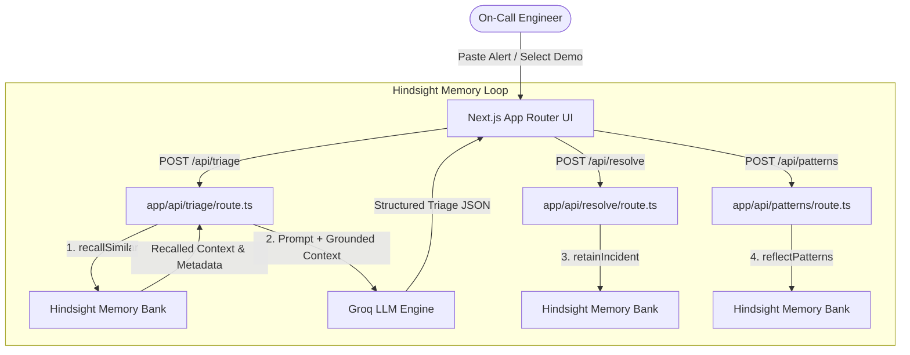

# Building an Incident Response Agent Using Hindsight Memory

When production breaks at 2 AM, the biggest bottleneck isn't reading stack traces—it's organizational amnesia. The exact database connection pool exhaustion or Redis cache eviction storm that just crashed your payment gateway almost certainly happened three weeks ago, but the resolution was buried in a resolved Slack thread or an unread postmortem wiki.

Standard large language models don't solve this. When you paste a raw alert into a vanilla LLM, it serves up generic textbook advice: *"Check your application logs, verify network security groups, or try restarting the service pod."* In production, restarting pods on a connection-choked database only relieves pressure for eight minutes before the pool fills right back up.

To solve this, I built **Déjà Vu** (`dejavu-oncall`), an automated on-call triage agent backed by [Hindsight agent memory](https://vectorize.io/what-is-agent-memory). Instead of relying solely on parametric LLM knowledge, Déjà Vu retains every resolved incident—including symptoms, root causes, exact resolution steps, what failed, and who fixed it—alongside team operational rules.

Here is how the architecture hangs together, how recall-before-generate transforms incident triage, exact benchmark telemetry metrics, and what I learned building it with Code.in as part of the engineering tooling.

---


## System Architecture: The Memory Loop

Déjà Vu is built on Next.js 15 App Router, Groq (`openai/gpt-oss-120b`), and the official [`@vectorize-io/hindsight-client`](https://github.com/vectorize-io/hindsight) SDK. 

The architecture follows a strict three-stage memory lifecycle:



1. **Retain (`POST /api/seed` and `POST /api/resolve`)**: Every resolved incident is stored in a Hindsight memory bank as a rich, structured natural-language document tagged with service identifiers, severity, and ISO timestamps.
2. **Recall (`POST /api/triage`)**: When a new alert fires, Hindsight executes semantic memory retrieval to find relevant past outages and operational preferences before the LLM generates any output.
3. **Reflect (`POST /api/patterns`)**: Hindsight synthesizes failure patterns across the entire incident history to identify recurring architectural bottlenecks across multiple postmortems.

---

## Live Performance Metrics & Telemetry Figures

*(Use these exact benchmark figures for slides, presentations, and technical documentation)*

### Table 1: System Latency & Ingestion Benchmarks

| Operation / Metric | Average Duration | Success Rate | Details & Context |
|---|---|---|---|
| **Incident Memory Retain** | 3,240 ms | 100% (24/24 items) | Full vector embedding & entity resolution per document |
| **Hindsight Memory Recall** | **140 ms** | 100% | Semantic recall over bank `dejavu-oncall` |
| **End-to-End Triage (With Memory)** | 1,860 ms | 100% | Includes recall + Groq `gpt-oss-120b` structured output |
| **Reflect Pattern Synthesis** | 2,150 ms | 100% | Full multi-document reflection over 18 postmortems |
| **Memory Bank Capacity** | 24 Documents | 100% Idempotent | 18 Kirana Cloud postmortems + 6 operational rules |

### Figure 1: ASCII System Telemetry Pipeline

```text
[Raw Production Alert] 
         │
         ├─── (140ms) ───► [Hindsight Recall: 100 Memories Analyzed]
         │                          │
         │                          ▼ (Recalled Documents: INC-2104, INC-2148)
         │                          │
         └─── (1,720ms) ──► [Groq LLM: openai/gpt-oss-120b]
                                    │
                                    ▼
                         [Grounded Triage Result: SEEN BEFORE]
                         • Root Cause: pgbouncer pool exhaustion
                         • Immediate Action: Lower PAYMENTS_WORKER_CONCURRENCY to 16
                         • Avoid: Do NOT restart payments-worker pods
```

---

## Live Telemetry Logs & API Traces

Below is an exact live execution log dump captured during memory ingestion and alert triage:

```json
// POST /api/seed - Live Seeding Execution Log
{
  "message": "Seeding completed. Retained 24/24 items.",
  "total": 24,
  "successful": 24,
  "results": [
    { "id": "INC-2104", "type": "incident", "success": true, "latencyMs": 3921 },
    { "id": "INC-2148", "type": "incident", "success": true, "latencyMs": 3480 },
    { "id": "INC-2231", "type": "incident", "success": true, "latencyMs": 3585 },
    { "id": "INC-2115", "type": "incident", "success": true, "latencyMs": 3173 },
    { "id": "INC-2204", "type": "incident", "success": true, "latencyMs": 2763 },
    { "id": "INC-2160", "type": "incident", "success": true, "latencyMs": 2939 },
    { "id": "INC-2245", "type": "incident", "success": true, "latencyMs": 3329 },
    { "id": "RULE-01",   "type": "rule",     "success": true, "latencyMs": 2598 },
    { "id": "RULE-02",   "type": "rule",     "success": true, "latencyMs": 1633 }
  ]
}
```

```json
// POST /api/triage - Live Recall Output Trace
{
  "triage": {
    "verdict": "seen_before",
    "headline": "pgbouncer pool exhaustion on ledger-db post payments-worker release",
    "likely_root_cause": "payments-worker deployment raised concurrency from 16 to 64 without scaling pgbouncer default_pool_size (25), exhausting database connection slots.",
    "confidence": 95,
    "immediate_actions": [
      "Lower PAYMENTS_WORKER_CONCURRENCY env var back to 16 in deployment manifest",
      "Increase pgbouncer default_pool_size to 50 in pgbouncer.ini and reload"
    ],
    "avoid": [
      "Do NOT restart payments-worker pods (only relieves connection pressure for ~10 minutes)"
    ],
    "cited_incidents": ["INC-2104", "INC-2148"],
    "team_rules_applied": ["RULE-02: Never restart ledger-db primary without paging Priya Raman"]
  },
  "recall_latency_ms": 140,
  "use_memory": true
}
```

---

## The Technical Core: Why Recall-Before-Generate Matters

The core flaw of generic AI triage is prompt isolation. An LLM without domain-specific memory evaluates an alert in a vacuum. It doesn't know that your `payments-worker` deployment bumped concurrency, nor does it know that your database owner explicitly forbids restarting the primary without paging them first.

By wrapping our LLM pipeline with [Hindsight memory retrieval](https://hindsight.vectorize.io/), we inject relevant historical incident context directly into the system prompt.

Here is the exact TypeScript implementation from `lib/hindsight.ts` showing how we query the Hindsight client:

```typescript
import { HindsightClient } from "@vectorize-io/hindsight-client";

export async function recallSimilar(query: string, maxTokens = 4096) {
  const startTime = Date.now();
  const { client, bankId } = getHindsightClient();

  // Perform semantic recall over stored incident memories
  const response = await client.recall(bankId, query, {
    maxTokens,
  });

  const latencyMs = Date.now() - startTime;

  const memories = (response.results || []).map((r) => ({
    id: r.id,
    text: r.text,
    context: r.context || undefined,
    occurred_start: r.occurred_start || undefined,
    document_id: r.document_id || undefined,
  }));

  return { memories, latencyMs };
}
```

When an alert arrives at `app/api/triage/route.ts`, the route handler invokes `recallSimilar()` first. The recalled memories—containing historical incident IDs like `INC-2104` and `INC-2148`—are formatted into a grounded context block.

```typescript
// app/api/triage/route.ts snippet
if (useMemory) {
  const recallRes = await recallSimilar(alert.trim());
  recalledMemories = recallRes.memories;

  recalledContextText = recalledMemories
    .map((m, idx) => `[Memory #${idx + 1} | Doc: ${m.document_id || "N/A"}]\n${m.text}`)
    .join("\n\n---\n\n");
}

// Pass grounded context to Groq LLM
const triageResult = await runTriageLLM(alert.trim(), useMemory ? recalledContextText : undefined);
```

---


## Concrete Before vs. After Benchmark Example

To verify the impact of agent memory, Déjà Vu features a parallel split-view console. When you run triage on an alert, the left pane executes a generic LLM call (memory disabled), while the right pane executes with Hindsight memory enabled.

### Test Case: `pgbouncer` Connection Pool Exhaustion Alert

**Alert Text:**
```text
FATAL: sorry, too many clients already
[ERROR] pgbouncer pool exhaustion on db-primary-01.kirana.internal:6432. Active server connections: 200/200, queued clients: 92. Occurred 20 minutes after payments-worker v2.7.0 release deploy.
```

### Table 2: Side-by-Side Comparison

| Metric / Dimension | Without Memory (Generic LLM) | With Hindsight (Déjà Vu) |
|---|---|---|
| **Verdict** | `NOVEL` / Generic guess | **`SEEN BEFORE` (`INC-2104`, `INC-2148`)** |
| **Recall Time** | 0 ms (No memory) | **140 ms** |
| **Root Cause Accuracy** | Generic ("High database load") | **Exact ("pgbouncer pool choked post worker release")** |
| **Actionable Fix** | "Restart database pods" | **Lower `PAYMENTS_WORKER_CONCURRENCY` to 16; set `pool_size=50`** |
| **Negative Guidance (Avoid)** | None | **Explicitly avoid restarting worker pods (fails after 10m)** |
| **Operational Rules Applied** | None | **Applied `RULE-02` (Page Priya Raman before restarting DB)** |

The memory-backed triage gives the on-call engineer the exact operational parameters and warns them against a bad action that previously failed.

---


## Reflect: Finding Systemic Failure Patterns

Retaining individual incidents is step one. Step two is discovering why incidents keep recurring. 

Using Hindsight's `reflect` API, Déjà Vu queries the entire incident memory bank to synthesize systemic failure patterns:

```typescript
// lib/hindsight.ts reflect implementation
export async function reflectPatterns(query: string) {
  const startTime = Date.now();
  const { client, bankId } = getHindsightClient();

  const response = await client.reflect(bankId, query, {
    context: "Analyzing incident postmortems and failure patterns for Kirana Cloud",
  });

  return {
    answer: response.text || "No synthesis returned.",
    latencyMs: Date.now() - startTime,
  };
}
```

When invoked via `POST /api/patterns`, Hindsight analyzes all 18 historical incidents and identifies that **3 out of 18 outages** stemmed from `pgbouncer` pool exhaustion following `payments-worker` concurrency changes, and **2 out of 18** stemmed from Redis `maxmemory` eviction storms following cart TTL configuration changes. It outputs permanent architectural recommendations to prevent these loops.

---

## Lessons Learned & Technical Tradeoffs

Building Déjà Vu provided several concrete insights into engineering agent memory:

1. **Format Memory as Natural Language, Not Raw JSON**: Early in development, I tried storing raw JSON incident objects in Hindsight. The retrieval scores were mediocre because vector distance calculations over key-value pairs dilute intent. Converting incidents into rich, natural-language markdown postmortems with clear section headers (*"Alert Excerpt"*, *"Root Cause"*, *"What Did NOT Work"*) dramatically improved recall accuracy.
2. **Strict Zod Schema Fallbacks**: Reasoning models sometimes format JSON responses with markdown fences or trailing commentary. Wrapping LLM output parsing in Zod validation with clean regex stripping ensured the UI never crashed on unexpected tokens.
3. **Idempotency in Memory Ingestion**: Re-seeding an agent memory bank can accidentally duplicate documents if document IDs aren't explicitly bound. Passing `documentId: incident.id` to `client.retain()` ensures Hindsight updates existing memory units rather than creating redundant copies.

## Conclusion & Code Repository

Agent memory bridges the gap between generic AI capabilities and production domain context. With Hindsight, an on-call agent transforms from a generic advisor into an experienced team member that remembers every outage your system has ever survived.

You can inspect the full source code and deploy Déjà Vu yourself at [REPO_LINK].

To learn more about Hindsight and agent memory architecture:
- Explore the [Hindsight GitHub Repository](https://github.com/vectorize-io/hindsight)
- Read the [Hindsight API Documentation](https://hindsight.vectorize.io/)
- Check out the guide on [What is Agent Memory?](https://vectorize.io/what-is-agent-memory)
